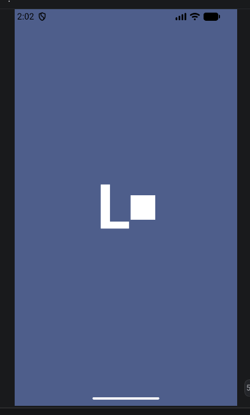
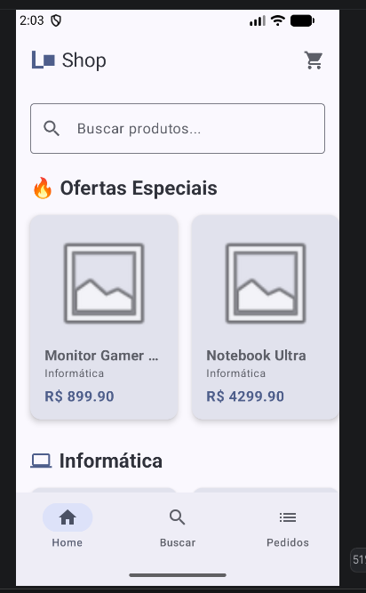
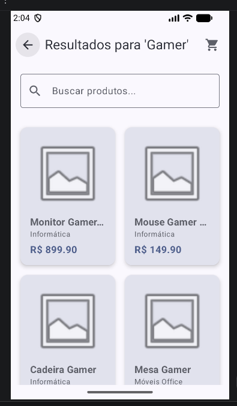
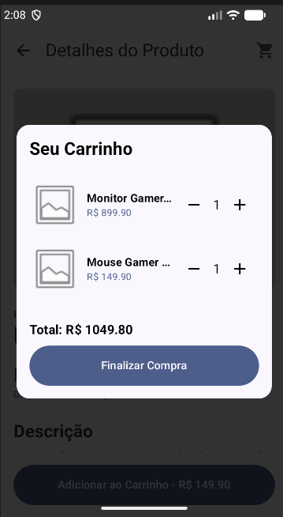
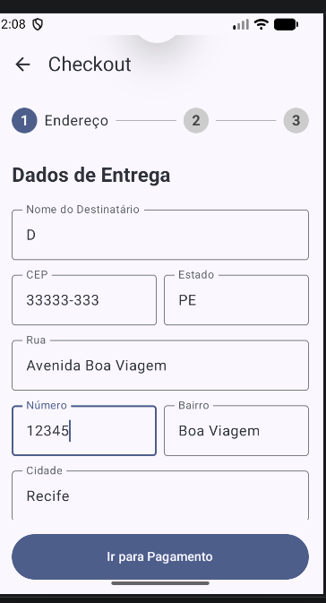
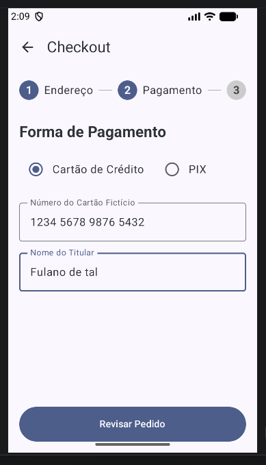
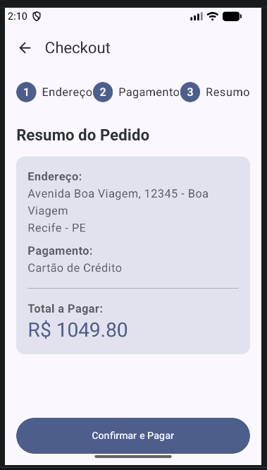
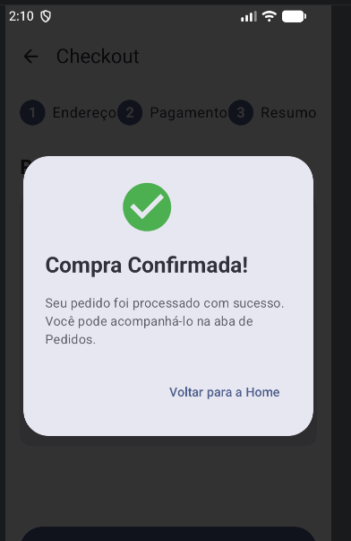
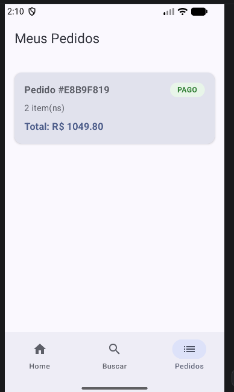
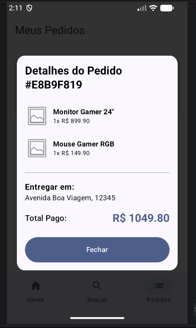

# Lojitas Shop

O Lojitas é um aplicativo de e-commerce e marketplace simples desenvolvido nativamente para Android utilizando Jetpack Compose. O objetivo do projeto é conectar produtos a clientes através de uma interface fluida, moderna e reativa, aplicando conceitos avançados de arquitetura de software e gerenciamento de estado.

## Funcionalidades e Telas

O aplicativo foi projetado para conter um fluxo de navegação completo e intuitivo, respeitando o limite e escopo do projeto:

* **Splash Screen:** Tela inicial com a identidade visual do app que navega automaticamente para a Home.



* **Página Inicial (Home):** Exibe uma barra de pesquisa, um carrossel de ofertas especiais e carrosseis horizontais separados dinamicamente por categoria. Conta com um botão flutuante (FAB) para voltar ao topo.



* **Busca de Produtos:** Tela dedicada para listar resultados de pesquisa, incluindo um *Empty State* amigável caso a busca não retorne resultados.
    


* **Detalhes do Produto:** Apresenta imagem, preço, estoque, categoria e descrição do item selecionado, permitindo a adição ao carrinho.


* **Carrinho de Compras (Modal Global):** Gerenciado no topo da árvore de navegação, permite adicionar, remover ou alterar a quantidade de itens a qualquer momento e de qualquer tela.



* **Checkout (Multi-step):** Formulário em etapas (Endereço -> Pagamento -> Resumo) com validação de campos, simulação de requisição de CEP (preenchimento automático) e simulação de pagamento via Cartão ou PIX.






* **Meus Pedidos:** Lista o histórico de compras com *badges* de status (Pago, Cancelado) e um modal interativo para visualizar os detalhes e itens de cada pedido.




## Tecnologias e Arquitetura

O projeto foi construído seguindo rigorosamente os requisitos da atividade: sem consumo de APIs externas, sem banco de dados real e sem arquitetura MVVM.

Para contornar a ausência do MVVM mantendo o código limpo e testável, o projeto adota a Clean Architecture aliada ao conceito de State Hoisting nativo do Jetpack Compose.

* **Linguagem:** Kotlin
* **UI Toolkit:** Jetpack Compose (Material Design 3)
* **Navegação:** Navigation Compose (`NavHost`, Rotas Tipadas e `NavArguments`)
* **Gerenciamento de Estado:** State Hoisting (`remember`, `mutableStateOf`, `derivedStateOf`)
* **Testes Unitários:** JUnit 4
* **Arquitetura:** Clean Architecture (Domain, Data, UI)

## Estrutura do Projeto

O código-fonte está organizado visando a separação de responsabilidades (Separation of Concerns):

```text
com.capgemini.deyvidsilva.lojitas
 ┣ data/
 ┃ ┣ mock/          # Simulação de banco de dados (Produtos, Categorias, Pedidos em memória)
 ┃ ┗ repository/    # Implementação do repositório de dados
 ┣ domain/
 ┃ ┣ entity/        # Modelagem de domínio (Produto, Pedido, Endereco, etc)
 ┃ ┗ usecase/       # Regras de negócio isoladas (Ex: FinalizarCompraUseCase)
 ┣ navigation/      # Configuração do NavGraph e roteamento
 ┣ ui/
 ┃ ┣ components/    # Componentes reutilizáveis (Botões, TopBar, Cards, Modais)
 ┃ ┣ screens/       # Telas do aplicativo gerenciando seus próprios estados
 ┃ ┗ theme/         # Tipografia, Cores e Tema do Lojitas
 ┗ MainActivity.kt
```

## Testes Unitários

A camada de domínio e dados está coberta por testes unitários escritos em JUnit 4. Foram criados Fakes da camada de repositório para garantir que os Use Cases sejam testados em total isolamento, validando o comportamento de buscas, adições e consultas.

## Como Executar

Clone este repositório:

```bash
git clone https://github.com/deyvidsalvatore/LojitasShop.git
```

Abra o projeto no Android Studio (Koala ou versão superior recomendada).

Aguarde a sincronização do Gradle.

Execute o projeto em um emulador ou dispositivo físico (Shift + F10).